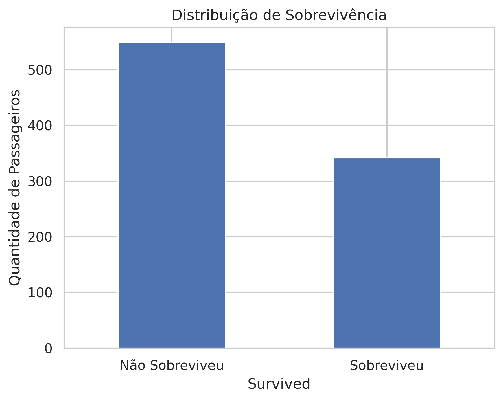
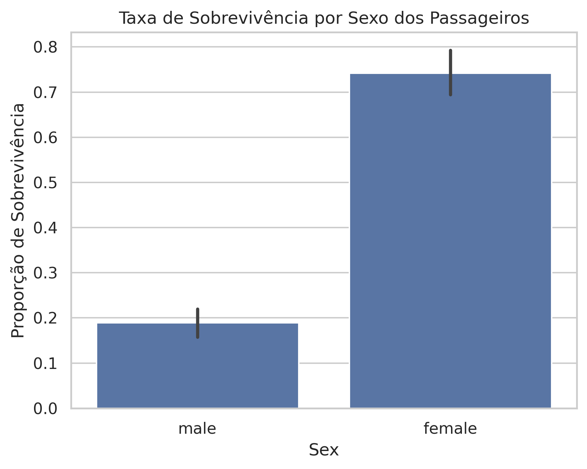
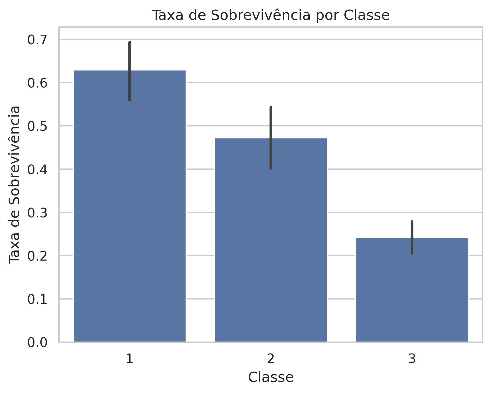
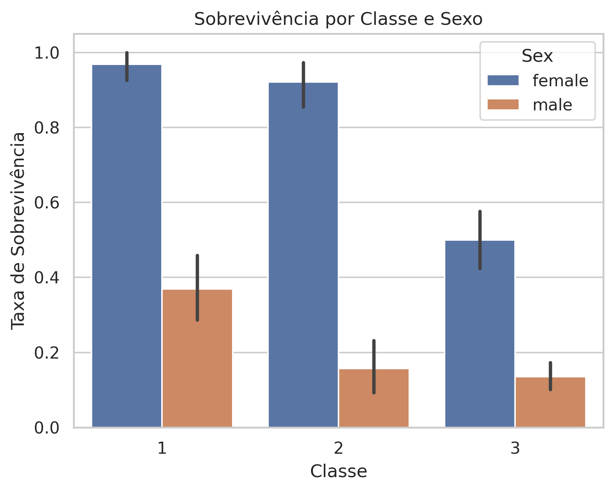
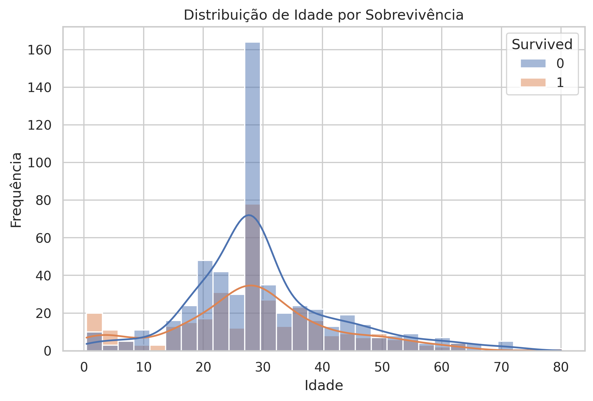
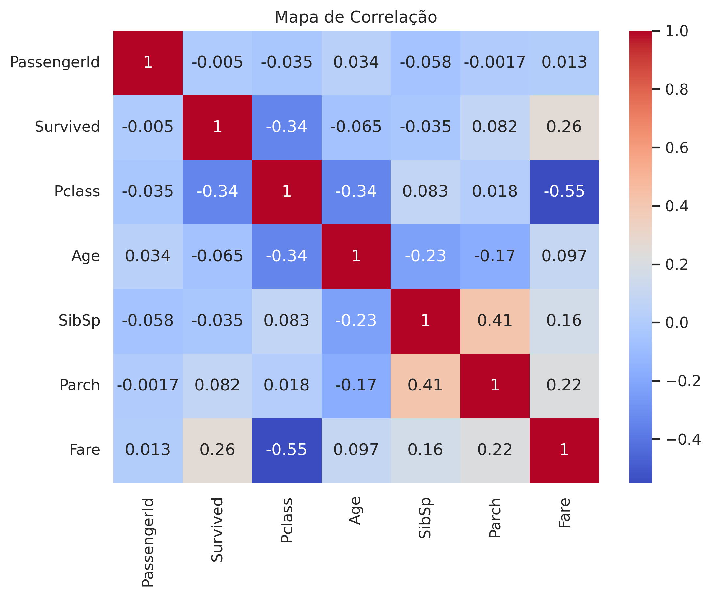

# Titanic Dataset – Análise Exploratória de Dados (EDA)

**Autor:** Cleberson Flores  
**Curso:** Introdução ao Data Science | 2026  

---

## Sobre o Projeto

Este projeto realiza uma **Análise Exploratória de Dados (EDA)** do dataset Titanic, focando em padrões de sobrevivência, idade, classe social e gênero.  
O objetivo é transformar dados brutos em **insights claros, visuais e impactantes**, mostrando fatores que influenciaram a sobrevivência dos passageiros.

Ferramentas usadas: **Python | Pandas | Matplotlib | Seaborn**  

---

## Principais Insights

- A **taxa geral de sobrevivência** foi de aproximadamente **38%**, indicando que a maioria dos passageiros não sobreviveu.  
- **Sexo** foi determinante: mulheres tiveram taxa de sobrevivência **4x maior** que homens.  
- **Classe social** influenciou diretamente: passageiros da **1ª classe** sobreviveram muito mais que os da 3ª classe.  
- **Crianças** apresentaram maior taxa de sobrevivência, sugerindo **prioridade no resgate**.  
- Correlação com sobrevivência:
  - `Pclass`: negativa moderada (-0,34)  
  - `Fare`: positiva moderada (0,26)  
  - `Age`: fraca (-0,06)  

---

## Dashboards e Gráficos

### 1. Distribuição de Sobrevivência

---

### 2. Taxa de Sobrevivência por Sexo

---

### 3. Taxa de Sobrevivência por Classe

---

### 4. Sobrevivência por Classe e Sexo

---

### 5. Distribuição de Idade por Sobrevivência

---

### 6. Mapa de Correlação

---

## Conclusão

O projeto evidencia que **sexo e classe social** foram os fatores mais determinantes para a sobrevivência no Titanic.  
As visualizações criadas permitem **comunicar insights de forma clara e visual**, tornando o projeto atrativo para estudantes de **Data Science e Análise de Dados**.  

Este projeto demonstra habilidade em **limpeza de dados, análise exploratória e visualização de informações**, essenciais para qualquer posição de análise de dados ou ciência de dados.

---

**Ferramentas Utilizadas:** Python | Pandas | Matplotlib | Seaborn
